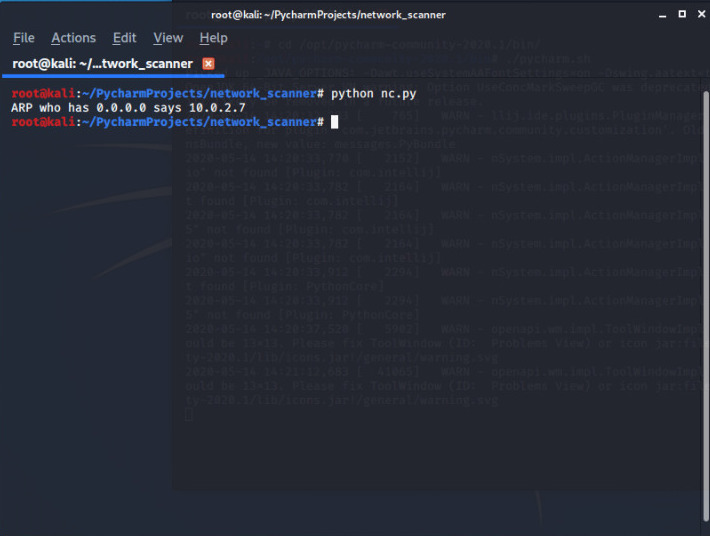
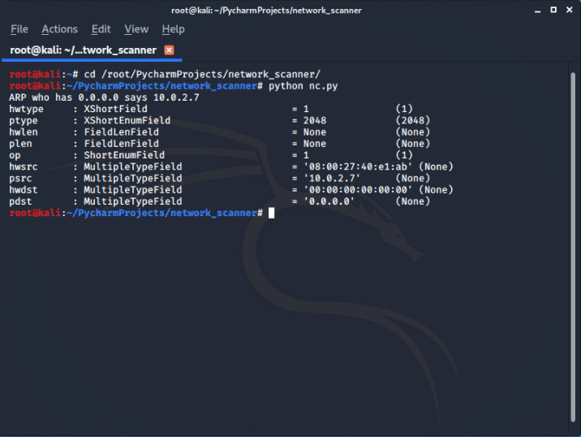
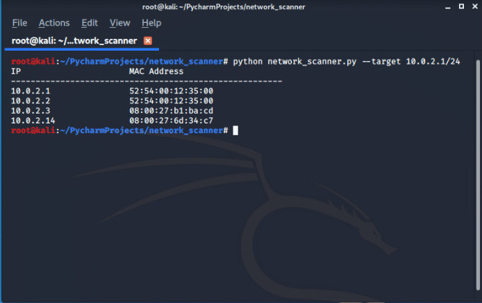

# Network-Scanner (using Python)

We will be building our own **NETWORK SCANNER** from scratch with th help of **python** and **scapy** and yes many of you will be thinking that we have already *netdiscover* and *N-map* and many other tools are their to scan number of clients on the same network but the goal behind this writeup is understand basically how a *network scanner* runs and grasp some more intresting concepts of python.

See there are number of ways to discover clients on same network but the easiest is to replicate what a normal device do to discover another network.


Suppose there a number of clients on same network and a *device-A* needs to communicate with the device *device-B* (Suppose A knows the IP Address of B) but remember this point that **communication between two device only happens BECAUSE  MAC Addresses not by IP Addresses**. In order to know the MAC Address of device-B , **device-A** will use a protocol known <mark>ARP</mark>.


ARP stands for **Address Resolution Protocol** this helps us to links between IP addresses and MAC addresses.So whenever devices know each other's  IP addresses they use ARP and send broadcast message (asking for a specific IP) in order to know the MAC address of the other device,(the devices which poses that specific IP will respond to that device by sending it's MAC Address).

In order to build our **network scanner** we will use the above concept of **ARP** the only change we will make that instead broadcasting  a message for an specific IP we will broadcast the message for all the IP's in that *subnet* , and in return we will get response from every device present on that same network.

>We will be using **scapy** module to build our network scanner, please read the [official documentation](https://scapy.readthedocs.io/en/latest/) to understand the code.

```python

#!/usr/bin/env python

import scapy.all as scapy

def scan(ip)
  scapy.arping(ip)

scan(10.0.2.1/24)

```

> **scapy.arping(ip)** is a inbuilt function in scapy which can scans all the  networks

after importing scapy we just defined a function *scan* which takes a range of IP.
10.0.2.1/24 : its a common way to define a range of IP it will scan IP addresses and if execute this program you will get the all no of clients with IP Address and MAC Addresses.

---


But instead of using **scapy.arping(ip)** we need to build our own way to do the same job for this we need to rewrite our function before writing any further code let's derive an algorithm for our tool.

1. Create arp request directed to broadcast MAC asking for IP
2. Send packet and recive response.
3. Parse response
4. Print results

Our first target is to create the arp request :

```python

#!/usr/bin/env python

import scapy.all as scapy

def scan(ip)
   arp_request = scan.ARP()
   print(arp_request.summary)

scan(10.0.2.1/24)

```



Instead 0.0.0.0 we need to set our own IP field for this you can add one more line of code to get help:

```python

#!/usr/bin/env python

import scapy.all as scapy

def scan(ip)
   arp_request = scan.ARP()
   print(arp_request.summary)
   scapy.ls(scapy.ARP())

scan(10.0.2.1/24)

```

>So we know that *pdst* is the field for IP Address and it will do our job easily :

```python

#!/usr/bin/env python

import scapy.all as scapy

def scan(ip)
   arp_request = scan.ARP(pdst=ip)
   print(arp_request.summary)


scan(10.0.2.1/24)

```
Now we need to set a destination MAC to broadcast MAC to make sure that it not limits to only one device and but  reaches to all devices for this we need to set a ethernet frame, in order to get all esential fields for *scapy.Ether()* we use *scapy.ls(scapy.Ether())*

```python

#!/usr/bin/env python

import scapy.all as scapy

def scan(ip)
   arp_request = scan.ARP(pdst=ip)
   broadcast = scapy.Ether()
   scapy.ls(scapy.Ether())

scan(10.0.2.1/24)

```


So  *dst* is the field to set MAC address but you must know that broadcast mac is a type of virtual MAC which doen't exsist but when you send something to it, all client recives it and by default it's  value is (six ff) "ff:ff:ff:ff:ff:ff".

```python

#!/usr/bin/env python

import scapy.all as scapy

def scan(ip)
   arp_request = scan.ARP(pdst=ip)
   broadcast = scapy.Ether(dst="ff:ff:ff:ff:ff:ff")
   arp_request_broadcast = broadcast / arp_request

scan(10.0.2.1/24)

```


>To combine  arp_request packet and broadcast packet into single packet we use "/" and store in to arp_request_broadcast


Now we need to send our packets and wait for response so for sending packet will use **scapy.srp** function and important point is that this function returns a <mark> a couple of two list </mark> first contains answered_list (answer, packet) and second one conains unanswered and  obviously we need answered_list and from answered_list we need the packets to display  and to get those we will iterate it through loop and since packet will contain a large no fields but we need only IP field (denoted by <mark> psrc </mark>) and MAC Address which is (denoted by <mark> hwsrc </mark>).

```python
#!/usr/bin/env python

import scapy.all as scapy


def scan(ip):
    arp_request = scapy.ARP(pdst=ip)
    broadcast = scapy.Ether(dst="ff:ff:ff:ff:ff:ff")
    arp_request_broadcast = broadcast / arp_request
    answered_list = scapy.srp(arp_request_broadcast, timeout=1, verbose=False)[0]

    print("IP\t\t\tMAC Address\n-------------------------------------------------------")
    for element in answered_list:
        print(element[1].psrc + "\t\t" + element[1].hwsrc)


scan("10.0.2.1/24")

```
Using timeout= 1 to avoid stucking in bash, \t\t\t are used for tabs and \n for new line to print our desired result in formatted way.

---

See if you are familiar to python very well than we can refatore our code to some extent with the help of *dictonaries*


```python

#!/usr/bin/env python

import scapy.all as scapy


def scan(ip):
    arp_request = scapy.ARP(pdst=ip)
    broadcast = scapy.Ether(dst="ff:ff:ff:ff:ff:ff")
    arp_request_broadcast = broadcast / arp_request
    answered_list = scapy.srp(arp_request_broadcast, timeout=1, verbose=False)[0]


    clients_list= []
    for element in answered_list:
        client_dict ={"ip": element[1].psrc, "mac": element[1].hwsrc}
        clients_list.append(client_dict)

    return clients_list


def print_result(results_list):
    print("IP\t\t\tMAC Address\n-------------------------------------------------------")
    for client in results_list:
        print(client["ip"] + "\t\t" + client["mac"])


scan_result = scan("10.0.2.1/24")
print_result(scan_result)

```

>We created a list in which all the elements are dictonaries containing IP Address and MAC Address for us at first we created an empty list clients_list= [] and we start through iterating through the answered_list and store that data in dictonary named client_dict and we are appending this dictonary to our empty list named clients_list= [].

Give a shot to the final code 

```bash

python network_scan.py

```




**Author** : [ERROR](https://github.com/Error-200)

**Blog** : [Click](https://noob-atbash.github.io/network_scan/)
